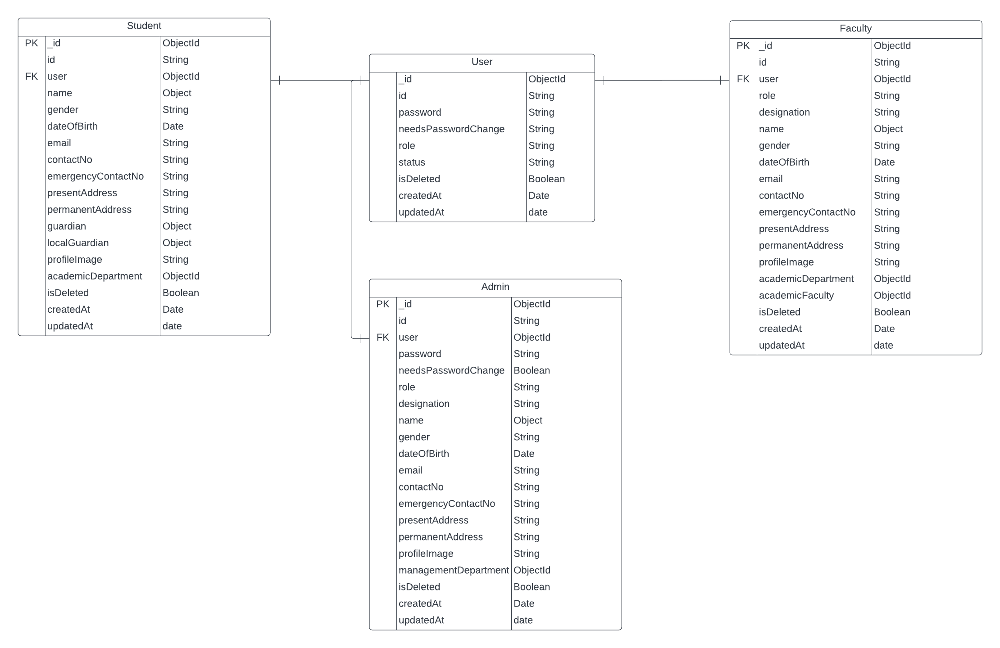
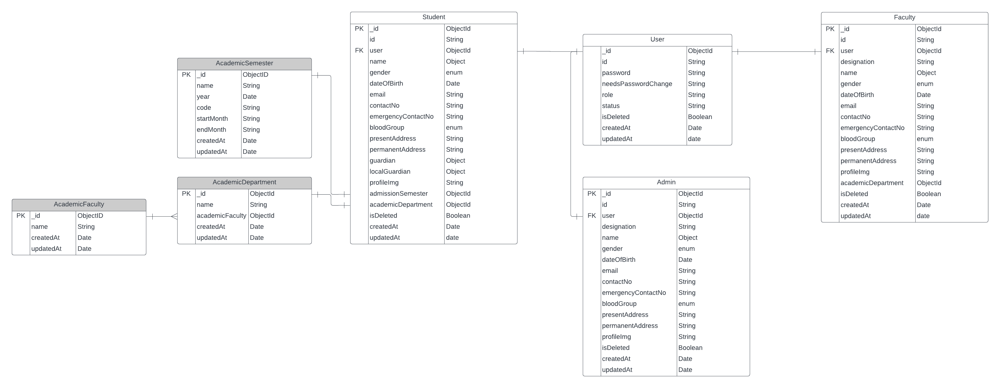

# PH-UNIVERSITY-5

### WE WILL KNOW

- Course & preRequisiteCourse (PreRequisite can be or not)
- Dynamically update course with prerequisite (Info Update and Pre Requisite set or remove)
- Faculty with course relation
- Semester Registration
- Business Logic Validation

#### findOne vs findById, findOneAndUpdate vs findByIdAndUpdate

- Model.create()
- Model.findOne()
- Model.findById()
- Model.findOneAndUpdate()
- Model.findByIdAndUpdate()
- Model.findOneAndDelete()
- Model.findByIdAndDelete()

